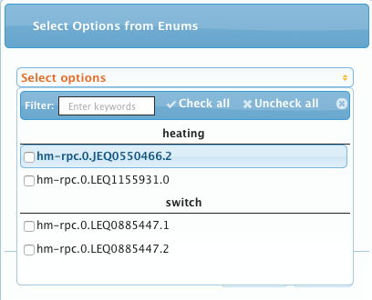
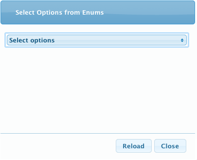
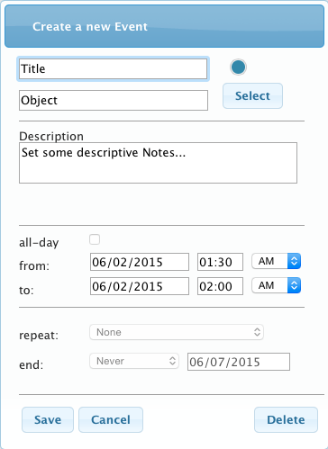
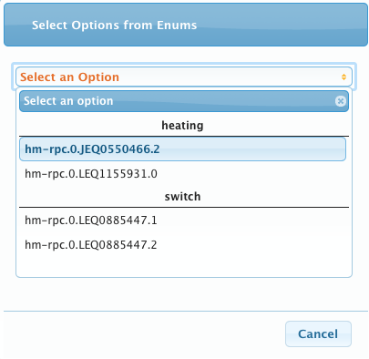
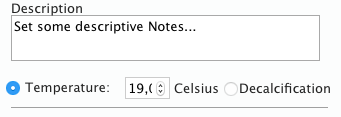
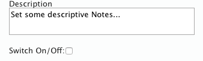
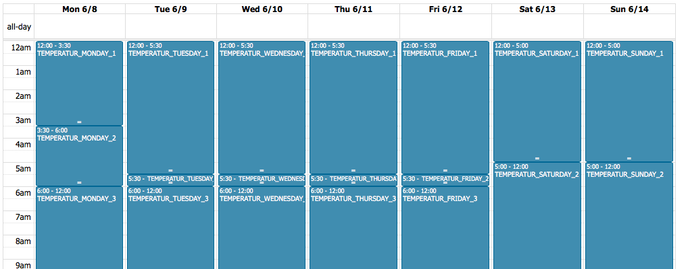
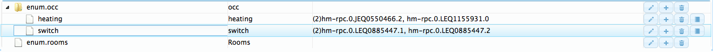

# iobroker.occ

## ACHTUNG, FUNKTIONIERT NUR MIT HM-RPC >= 0.5.0
   Muss mittels Link direkt installiert werden
   (npm install https://github.com/ioBroker/ioBroker.hm-rpc/tarball/master --production)

## Bugfix
- Startup Alert bei Initialladen / Reload des Kalenders.
- Es kann zu keiner Anzeige nach Auswahl eines Geräts kommen
	- Einfach die Woche wechseln, dann werden die Daten angezeigt
- Entkalkungszeitpunkt
- Angehakte Elemente in der Select Options Maske bleiben bei Reload erhalten
- hm-rpc Verbindungen

## Erweiterungen
- Steuerung von allen State Objekten möglich
	- hm-rega
- Objekte können als 
	- "Fully Qualified" - hm-rpc.0.JEQ0710450.2.STATE
	- "Short Name" - JEQ0710450.2
	- "Name" - Licht Gang Nord
	eingegeben werden
- Objekte können mittels iCal gesteuert werden
	- Getestet wurde ein Google Account
	- Es muss eine iCal Instanz existieren (Derzeit nur eine Instanz verwendbar)
	- In das Kommentarfeld eines Events muss folgende Logik eingebaut sein
		- occ#OBJECT_ADDRESS#OBJECT_VALUE
		- Beispiele
			- HM-LC-Sw2-FM, HM-LC-Sw4-DR (Value muss on oder off sein)
		- occ#Licht Gang Nord#on
		- occ#Licht Gang Nord#off
			- Rega Variablen (Boolean muss true oder false sein)
		- occ#RegaVar-Boolean#true
		- occ#RegaVar-Boolean#false
		- occ#RegaVar-String#My Favourite Text
	- Derzeit werden folgende Typen unterstützt
		- hm-rega
			- Value, Number, String, Boolean
		- hm-rpc
			- Switch
	- Für on/off, true/false Events werden immer 2 Scheduler Objekte generiert
		- 1. Eintrag mit dem eingetragenen Wert
		- 2. Eintrag mit dem negierten Wert
- Anzeige von Namen in Optionsmaske
- Beim Öffnen des Kalendars wird eine Wartemaske angezeigt (Daten werden im Hintergrund geladen)

## Offene Punkte:
- Verteiltes System (mehrere Hosts)
- Wiederholende Einträge
- Skripte steuern
- Übersetzung (Deutsch, Englisch, Russisch)
- Umbenennung von iobroker.occ zu ioBroker.occ
- Boost Temperature aktivieren
- jQuery Mobile

## Beschreibung:
Der Adapter Object Control Calendar (kurz iobroker.occ) ist ein Webkalender auf Basis fullcalendar (http://www.fullcalendar.io). Mit dem Kalender werden Homematic Thermostaten, Homematic Funk-Releais und MAX! Thermostaten zeitlich gesteuert.

Derzeit können folgende Objekte gesteuert werden:
.) Thermostat
	.) HM-CC-TC (Homematic)
	.) HM-CC-RT-DN (Homematic)
	.) BC-RT-TRX-CyG-3 (Max!)
.) Schaltaktor
	.) HM-LC-Sw1-FM
	.) HM-LC-Sw2-FM
	.) HM-LC-Sw4-DR

Die Thermostaten werden bei Start von ioBroker.occ ausgelesen. Pro Gerät wird in iobroker-data/files/occ.0 eine JSON Datei angelegt.
Für die Thermostaten werden nur Einträge für die aktuelle Woche erzeugt. (Sonntags wird die nächste Woche angelegt).
Die Schaltaktoren besitzen keine Intelligenz für Kalendar. Die JSON Datei wird über den Webkalendar erzeugt.
Beim Start von occ werden bereits angelegte JSON Dateien für Schaltaktoren eingelesen und neue Scheduler Objekte erzeugt.

Bei Anpassung der Geräte im Webkalendar werden durch den Button “Save” die Änderungen in den JSON Dateien gespeichert.
Da die Kommunikation mit Homematic Endgeräten gering gehalten werden muss, erfolgt die Übertragung der Thermostat Kalendereinträge nur über den Button “Submit”.
Nach Übermittlung der Daten an das Gerät wird ein sogenanntes “CONFIG_PENDING” ausgelöst.
Sobald die Daten korrekt übermittelt wurden, liest occ diese Daten neu aus und legt sie am Dateisystem ab.

Die Schaltaktoren werden über den node-schedule gesteuert.
z.B. Event: Sonntag 07.06.2015 19:00 - 19:30, Switch: on
Dies bedeutet das am 07.06.2015 19:00 der Schaltaktor eingeschaltet wird und um 19:30 wieder aus.

Zusätzlich gibt es die Möglichkeit, für “Object”, Einträge anzulegen, welche nicht Gerätespezifisch am Dateisystem als occ-events_Object.json gespeichert werden.
Diese Kalendereinträge sind derzeit immer sichtbar.
Diese Option darf nach dem Speichern nicht mehr geändert werden, da ansonsten die lokale JSON Datei überschrieben wird!

## Bekannte Fehler:
- CONFIG_PENDING wird bei MAX! Thermostaten nicht beendet
- In der “Select Options” Maske
	- Wenn Einträge aktiviert sind und es wird der “Reload” Button gedrückt, werden die Checkboxen abgewählt, die Einträge im Kalender bleiben aber aktiv.
- Bei wiederholtem Drücken des “Submit” Buttons zur Übertragung der Daten an die Geräte, blockiert homematic die Kommunikation.
- Bei neuem Auslesen der Geräte mittels occ werden immer neue Farben verwendet.
- Sonntags wird der Kalender für Thermostaten für die darauffolgende Woche erzeugt.

## Funktionen:
Der ObjectControlCalendar (OCC) beinhaltet derzeit folgende Funktionen:

1.) Select Options
	Hiermit können die jeweiligen Geräte Daten innerhalb des Kalenders angezeigt werden
	Mittels “Reload” werden die JSON Dateien neu vom Dateisystem eingelesen und die Enumerationen neu berechnet

2.) Bei Auswahl eines leeren Zeitraums im Kalender wird eine “Neuer Event” Maske geöffnet
	Bei Auswahl eines Kalendereintrages dementsprechend der Eintrag

Farbkreisel: Hiermit können Kalendereinträge farblich unterschieden werden
Title: Titel des Kalender Eintrags 
Object: Das zu verwendende Gerät
Select Button: Auswahl des Geräts

Description: Beschreibung
all-day: Event für einen ganzen Tag (Derzeit deaktiviert)
from: Beginn
to: Ende
repeat: Derzeit deaktiviert
end: Derzeit deaktiviert
Save Button: Speichern der Daten als JSON (Thermostat-Daten werden NICHT übertragen)
Cancel Button: Abbrechen der Eingaben
Delete Button: Löschen des Eintrags im Kalender und in der JSON Datei

Bei Auswahl eines Thermostaten erscheint zusätzlich die Temperatur Anzeige bzw. die Auswahl für die 
Entkalkung (derzeit deaktiviert)

Bei Auswahl eines Schaltaktors erscheint die Ein / Aus Funktion

3.) Bei Auswahl eines Objektes innerhalb von “Select Options” sollte der Kalender ähnlich aussehen:

Hier können nun die einzelnen Kalender Einträge angepasst werden.

Folgende Logik muss für Homematic/MAX! Thermostaten eingehalten werden (lt. Homematic Spezifikation):

1.) Pro Tag muss ein Eintrag vorhanden sein, der erste Eintrag muss folgendermassen lauten:
	HM-CC-TC:
		Name: TEMPERATUR_<DAY>_0
	HM-CC-RT-DN und BC-RT-TRX-CyG-3
		Name: TEMPERATURE_<DAY>_0

2.) Jeder weitere Eintrag muss hochgezählt werden (TEMPERATUR_<DAY>_+1

3.) Es dürfen max. 25 Einträge pro Tag verwendet werden

4.) Einträge dürfen sich nicht überschneiden

5.) Die Temperatur darf min Temperatur nicht unterschreiten und max Temperatur nicht überschreiten

6.) Wenn ein Eintrag gelöscht wird, müssen die anderen lt. Punkt 1-4 angepasst werden

Folgende Logik muss für Homematic Schaltaktoren eingehalten werden

1.) Einträge sollen sich nicht überschneiden

## Getestete Systeme:
- OS: Linux, Mac OSX
- Windows Systeme sollten keinen Fehler beim Installieren bekommen, postinstall wurde OS unabhängig aufgebaut

## Abhängigkeiten:
- node-schedule@0.2.8 (long-timeout@0.0.2, cron-parser@0.6.2)
- homematic-xmlrpc@1.0.1 (xmlbuilder@0.4.2, sax@0.4.3)
- fullcalendar@2.3.1 (jquery@2.1.4, moment@2.10.3)

## Voraussetzungen:
- aktueller ioBroker
- aktuelle ioBroker.hm-rpc
- ioBroker.hmm (oder sonstiges Tool, um sich die Konfiguration am Objekt ansehen zu können)
- ioBroker.web
- ioBroker.iCal
- es muss mind. ein hm-rpc mittels XML verfügbar sein, BIN ist nicht unterstützt (Getestet wurde nur der Homegear Daemon)

## Installation:
Die ersten beiden Schritte sind solange notwendig, bis
das Modul in ioBroker integriert ist.

1.) Wechsel in das Home Verzeichnis von ioBroker

2.) Wechsel in das Verzeichnis node_modules

3.) Eingabe von npm install iobroker.occ

4.) Hinzufügen einer Instanz mittels ioBroker Admin Web Oberfläche
	Es wird automatisch eine ioBroker.web Instanz mit installiert, falls nicht vorhanden

5.) Einrichten von Enumerations

6.) Dazu in der ioBroker Admin Web Oberfläche in den Reiter Enums wechseln und links oben auf das + klicken
	Name = occ (Dieser Name muss occ sein!)

7.) Beim hinzugefügten Enum rechts auf das + klicken
	Name = heating (Dieser Name wird für nur für die Gruppierung verwendet und kann frei vergeben werden)
	Für jede Gruppe z.B. heating = Heizung, switch = Schalter, eine eigene Gruppe anlegen

8.) Beim hinzugefügten Objekt nun das Notizbuch Symbol klicken
	Nun müssen die einzelnen zu steuernden Objekte hinzugefügt werden
	Für HM-CC-TC den Kanal 2 auswählen und auf Select klicken (ist nicht aktiv, kann trotzdem angewendet werden)
	Für HM-CC-RT-DN den Kanal 0 auswählen
	Für BC-RT-TRX-CyG-3 den Kanal 0 auswählen
	Für HM-LC-Sw2-FM, HM-LC-Sw1-FM, HM-LC-Sw4-DR den jeweiligen zu schaltenden Kanal auswählen
	Wenn alles richtig ist, sollte es ungefähr so aussehen:

9.) Zurückwechseln in die Lasche Instances

10.) Die Konfiguration von ioBroker.occ öffnen
	RPC Listen IP: Die ioBroker IP Adresse eintragen
	RPC Listen Port Begin: Der kleinste Listener Port für die hm-rpc Kommunikation, wird pro Instanz automatisch hochgezählt
	Demo Mode (save back to object disabled): Es werden die Kalenderdaten nur am lokalen Dateisystem geschrieben, es findet keine Übertragung zu den Objekten statt

11.) Starten von ioBroker.occ
	Achtung: Beim erstmaligen Start, kommt es zum Fehler “Could not read occ-events_xxxxxxxxx.json”
	Dieser ist gewollt, es sind noch keine Daten am lokalen Dateisystem vorhanden

12.) Nach Start des occ Adapters kann dieser nun in der Weboberfläche geöffnet werden
	Die Weboberfläche ist immer aktiv, sollte der Adapter nicht aktiv sein, werden die Daten nur am lokalen Dateisystem geschrieben, es findet keine Übertragung zu den Objekten statt

13.) Der erste Popup, ist im Moment noch ein Platzhalter (Startup)

## Changelog
### 0.2.4
- (husky-koglhof) iCal Variablensteuerung, Fehler behoben
- Drag'n Drop der Events, Fehler behoben
- iCal Events auf Read Only gesetzt
- Logging angepasst

### 0.2.3
- (husky-koglhof) Calendar per Parametersteuerung als iFrame in Vis anzeigbar

### 0.2.2
- (bluefox) Sprache in io-package.json hinzugefügt
  (husky-koglhof)
  Hardcodierung entfernt
  Fehler beim ändern von Kalendereinträgen behoben
  
### 0.2.1
* (husky-koglhof)
- Bugfix:
	- Beim auswählen eines Eintrags wurde bei AM/PM immer AM ausgewählt und nicht
	  der korrekte Eintrag
	  
### 0.2.0
* (husky-koglhof)
- Bugfix:
	- Abhängigkeit zu hm-rpc rausgelöst, es wird nun hm-rpc mittels sendTo abgefragt.
	- Entfernt: Force objects re-init (once): Es werden alle Kalenderdaten von den Objekten eingelesen und am lokalen Dateisystem überschrieben
		- Es werden immer alle Daten beim Start neu geladen
	- Entfernt: Async Save Mode: Derzeit nicht implementiert
- Features:
	- adminTab implementiert: ab Version ioBroker 0.7.0 erscheint occ als eigener Tab in der Oberfläche
	- hm-rpc als Dependency in io-package.json hinzugefügt
	
### 0.1.20
* (husky-koglhof) 
- Bugfix:
- admin.html: iCal Language Support
- io-package.json: ical Dependency und native ical true
- main.js: Abfrage ob iCal Parameter gesetzt
- io-package.json: readme link hinzugefügt, loglevel auf info gesetzt
- img: Alle Images hochgeladen

### 0.1.2
* (husky-koglhof) Siehe Dokumentation

### 0.1.0
* (husky-koglhof) Siehe Dokumentation

### 0.0.4
* (husky-koglhof) add Dependencies for automatic Installation

### 0.0.1
* (husky-koglhof) HTML Prototyp

## Lizenz

Copyright (c) 2015 husky-koglhof

[CC BY-NC-SA 4.0](http://creativecommons.org/licenses/by-nc-sa/4.0/)

Der obige Urheberrechtsvermerk ist in allen Kopien oder Teilkopien der Software beizulegen.

DIE SOFTWARE WIRD OHNE JEDE AUSDRÜCKLICHE ODER IMPLIZIERTE GARANTIE BEREITGESTELLT, EINSCHLIESSLICH DER GARANTIE ZUR BENUTZUNG FÜR DEN VORGESEHENEN ODER EINEM BESTIMMTEN ZWECK SOWIE JEGLICHER RECHTSVERLETZUNG, JEDOCH NICHT DARAUF BESCHRÄNKT. IN KEINEM FALL SIND DIE AUTOREN ODER COPYRIGHTINHABER FÜR JEGLICHEN SCHADEN ODER SONSTIGE ANSPRÜCHE HAFTBAR ZU MACHEN, OB INFOLGE DER ERFÜLLUNG EINES VERTRAGES, EINES DELIKTES ODER ANDERS IM ZUSAMMENHANG MIT DER SOFTWARE ODER SONSTIGER VERWENDUNG DER SOFTWARE ENTSTANDEN.

HomeMatic und BidCoS sind eingetragene Warenzeichen der [eQ-3 AG](http://eq-3.de)
